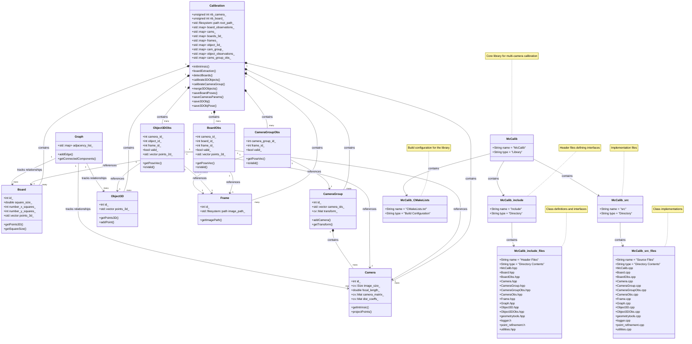

# UML Class Diagram

```mermaid
classDiagram
    class Calibration {
        +unsigned int nb_camera_
        +unsigned int nb_board_
        +std::filesystem::path root_path_
        +std::map<int, std::shared_ptr<BoardObs>> board_observations_
        +std::map<int, std::shared_ptr<Camera>> cams_
        +std::map<int, std::shared_ptr<Board>> boards_3d_
        +std::map<int, std::shared_ptr<Frame>> frames_
        +std::map<int, std::shared_ptr<Object3D>> object_3d_
        +std::map<int, std::shared_ptr<CameraGroup>> cam_group_
        +std::map<int, std::shared_ptr<Object3DObs>> object_observations_
        +std::map<int, std::shared_ptr<CameraGroupObs>> cams_group_obs_
        +initIntrinsic()
        +boardExtraction()
        +detectBoards()
        +calibrate3DObjects()
        +calibrateCameraGroup()
        +merge3DObjects()
        +saveBoardPoses()
        +saveCamerasParams()
        +save3DObj()
        +save3DObjPose()
    }

    class Board {
        +int id_
        +double square_size_
        +int number_x_squares_
        +int number_y_squares_
        +std::vector<cv::Point3f> points_3d_
        +getPoints3D()
        +getSquareSize()
    }

    class BoardObs {
        +int camera_id_
        +int board_id_
        +int frame_id_
        +bool valid_
        +std::vector<cv::Point2f> points_2d_
        +getPoseVec()
        +isValid()
    }

    class Camera {
        +int id_
        +cv::Size image_size_
        +double focal_length_
        +cv::Mat camera_matrix_
        +cv::Mat dist_coeffs_
        +getIntrinsic()
        +projectPoints()
    }

    class CameraGroup {
        +int id_
        +std::vector<int> camera_ids_
        +cv::Mat transform_
        +addCamera()
        +getTransform()
    }

    class Object3D {
        +int id_
        +std::vector<cv::Point3f> points_3d_
        +getPoints3D()
        +addPoint()
    }

    class Object3DObs {
        +int camera_id_
        +int object_id_
        +int frame_id_
        +bool valid_
        +std::vector<cv::Point2f> points_2d_
        +getPoseVec()
        +isValid()
    }

    class CameraGroupObs {
        +int camera_group_id_
        +int frame_id_
        +bool valid_
        +getPoseVec()
        +isValid()
    }

    class Frame {
        +int id_
        +std::filesystem::path image_path_
        +getImagePath()
    }

    class Graph {
        +std::map<int, std::vector<int>> adjacency_list_
        +addEdge()
        +getConnectedComponents()
    }

    class McCalib {
        +String name = "McCalib"
        +String type = "Library"
    }

    class McCalib_include {
        +String name = "include"
        +String type = "Directory"
    }

    class McCalib_src {
        +String name = "src"
        +String type = "Directory"
    }

    class McCalib_CMakeLists {
        +String name = "CMakeLists.txt"
        +String type = "Build Configuration"
    }

    class McCalib_include_files {
        +String name = "Header Files"
        +String type = "Directory Contents"
        +McCalib.hpp
        +Board.hpp
        +BoardObs.hpp
        +Camera.hpp
        +CameraGroup.hpp
        +CameraGroupObs.hpp
        +CameraObs.hpp
        +Frame.hpp
        +Graph.hpp
        +Object3D.hpp
        +Object3DObs.hpp
        +geometrytools.hpp
        +logger.h
        +point_refinement.h
        +utilities.hpp
    }

    class McCalib_src_files {
        +String name = "Source Files"
        +String type = "Directory Contents"
        +McCalib.cpp
        +Board.cpp
        +BoardObs.cpp
        +Camera.cpp
        +CameraGroup.cpp
        +CameraGroupObs.cpp
        +CameraObs.cpp
        +Frame.cpp
        +Graph.cpp
        +Object3D.cpp
        +Object3DObs.cpp
        +geometrytools.cpp
        +logger.cpp
        +point_refinement.cpp
        +utilities.cpp
    }

    Calibration "1" *-- "many" Board : contains
    Calibration "1" *-- "many" BoardObs : contains
    Calibration "1" *-- "many" Camera : contains
    Calibration "1" *-- "many" CameraGroup : contains
    Calibration "1" *-- "many" Object3D : contains
    Calibration "1" *-- "many" Frame : contains
    Calibration "1" *-- "many" Object3DObs : contains
    Calibration "1" *-- "many" CameraGroupObs : contains

    BoardObs "1" --> "1" Board : references
    BoardObs "1" --> "1" Camera : references
    BoardObs "1" --> "1" Frame : references

    Object3DObs "1" --> "1" Object3D : references
    Object3DObs "1" --> "1" Camera : references
    Object3DObs "1" --> "1" Frame : references

    CameraGroupObs "1" --> "1" CameraGroup : references
    CameraGroupObs "1" --> "1" Frame : references

    CameraGroup "1" *-- "many" Camera : contains

    Graph "1" --> "many" Board : tracks relationships
    Graph "1" --> "many" Camera : tracks relationships
    Graph "1" --> "many" Object3D : tracks relationships

    McCalib --> McCalib_include : contains
    McCalib --> McCalib_src : contains
    McCalib --> McCalib_CMakeLists : contains
    McCalib_include --> McCalib_include_files : contains
    McCalib_src --> McCalib_src_files : contains

    note for McCalib "Core library for multi-camera calibration"
    note for McCalib_include "Header files defining interfaces"
    note for McCalib_src "Implementation files"
    note for McCalib_CMakeLists "Build configuration for the library"
    note for McCalib_include_files "Class definitions and interfaces"
    note for McCalib_src_files "Class implementations"
```
