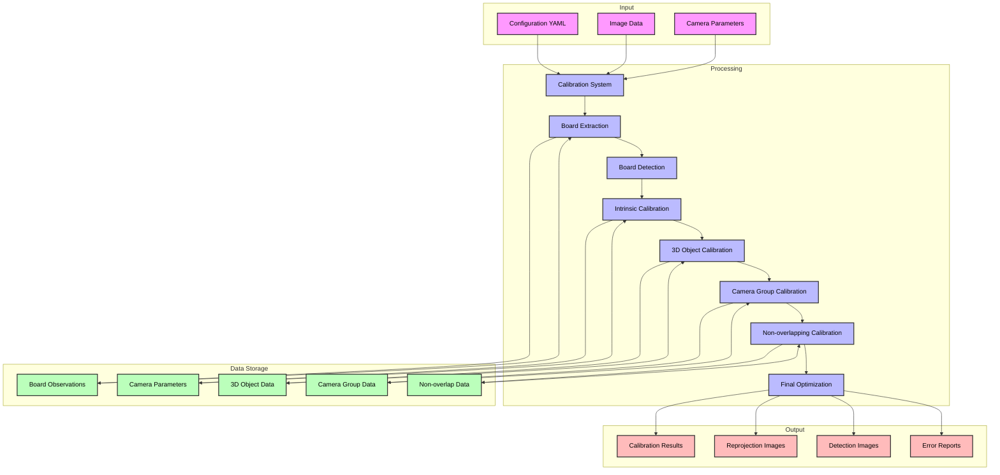

# UML Data Flow Diagram

```mermaid
flowchart TD
    %% Input Nodes
    A[Configuration YAML] --> B[Calibration System]
    C[Image Data] --> B
    D[Camera Parameters] --> B

    %% Processing Nodes
    B --> E[Board Extraction]
    E --> F[Board Detection]
    F --> G[Intrinsic Calibration]
    G --> H[3D Object Calibration]
    H --> I[Camera Group Calibration]
    I --> J[Non-overlapping Calibration]
    J --> K[Final Optimization]

    %% Data Storage
    L[Board Observations] --> E
    E --> L
    M[Camera Parameters] --> G
    G --> M
    N[3D Object Data] --> H
    H --> N
    O[Camera Group Data] --> I
    I --> O
    P[Non-overlap Data] --> J
    J --> P

    %% Output Nodes
    K --> Q[Calibration Results]
    K --> R[Reprojection Images]
    K --> S[Detection Images]
    K --> T[Error Reports]

    %% Subgraphs for Organization
    subgraph Input
        A
        C
        D
    end

    subgraph Processing
        B
        E
        F
        G
        H
        I
        J
        K
    end

    subgraph Data Storage
        L
        M
        N
        O
        P
    end

    subgraph Output
        Q
        R
        S
        T
    end

    %% Styling with better text visibility
    classDef input fill:#f9f,stroke:#333,stroke-width:2px,color:#000
    classDef process fill:#bbf,stroke:#333,stroke-width:2px,color:#000
    classDef storage fill:#bfb,stroke:#333,stroke-width:2px,color:#000
    classDef output fill:#fbb,stroke:#333,stroke-width:2px,color:#000

    class A,C,D input
    class B,E,F,G,H,I,J,K process
    class L,M,N,O,P storage
    class Q,R,S,T output
```
